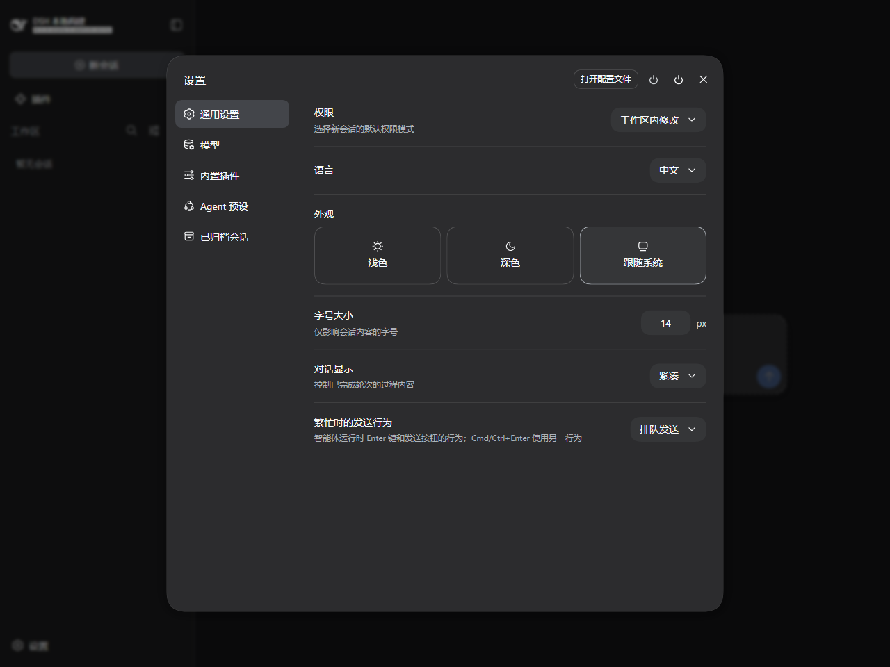
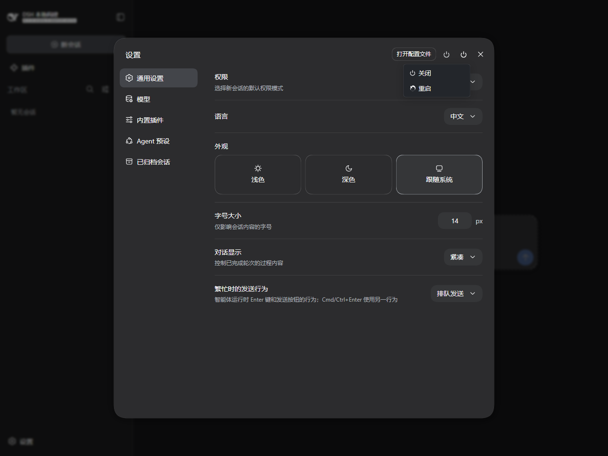
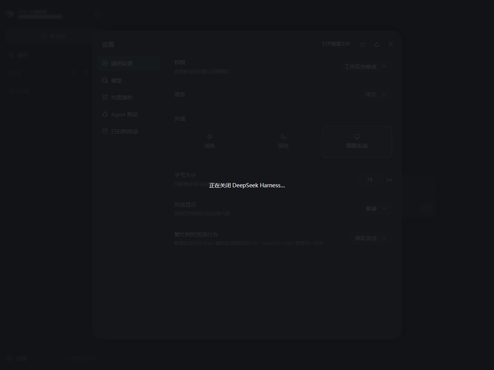
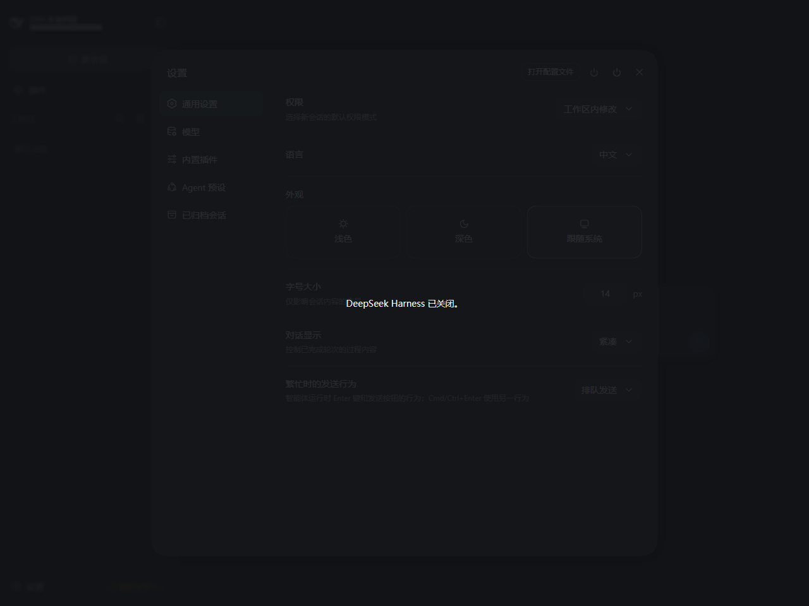
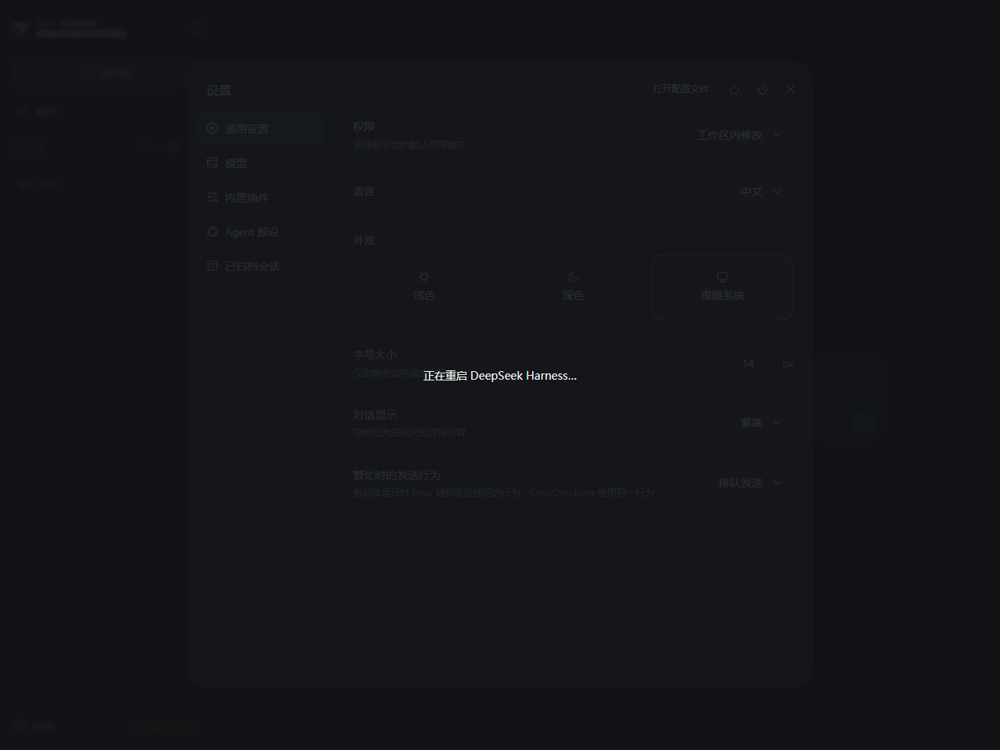

# dsh-system-power

A DeepSeek Harness (DSH) plugin that adds a **Power** button to the Settings header — next to the "open config file" button — with **Shutdown** and **Restart** actions for the DSH host process.

Stock DSH has no power control in the Settings page. This plugin is fully self-contained: it ships its own host capability (a `systemPower` Remote namespace with `shutdown` / `restart`), so it works on a **clean DSH install with zero source edits**. Reinstall DSH later? Just reinstall the plugin.

## What you get

- A power button in the Settings header (top-right, next to **打开配置文件 / Open config file**), opening a **Shutdown / Restart** menu.
- **Shutdown** stops the DSH host process after acknowledging the request.
- **Restart** spawns a detached copy of the same command (without auto-opening a browser; the existing tab reloads itself) and then exits the old process.
- The full-screen overlay and the auto-reload-after-restart behavior mirror the built-in settings shell.
- If the host build already carries a power action under the reserved id `system-power` (e.g. a locally patched DSH), this plugin yields to it and does **not** add a duplicate button.

## Screenshots

The power button appears in the Settings header, right next to **Open config file**:



Clicking it opens the **Shutdown / Restart** menu:



Firing an action raises a full-screen overlay:



Once the host has exited, the overlay settles on a static message:



Restart shows its own notice and reloads the page as soon as the new process answers:



## Install

Install from the package directory or a packed tarball:

```bash
# from the package directory
dsh plugin --profile <profile> add /path/to/dsh-system-power

# or from a packed tarball
dsh plugin --profile <profile> add dsh-system-power-0.1.0.tgz
```

Then restart DSH. Open **Settings** and the power button appears in the top-right corner.

## Build from source

```bash
npm install
npm run build
```

The build emits two artifacts into `lib/`:

- `lib/index.js` — the host Loader entry (registers the `systemPower` Remote namespace; the Typert binding and `@Remote` method markers are written by hand, so the plugin has no runtime dependency on the protocol package).
- `lib/client.js` — the browser bundle served by the DSH client-modules system.

## Requirements

- DSH 0.1.x with the web settings shell (`dsh-client-ui-settings`).
- The plugin row is inserted after the web-app bundles, so it works on stock profiles.

## How it works

| Piece | Where | What it does |
|---|---|---|
| Host `SystemPowerController` | `src/index.ts` | Registers `systemPowerController` via `ctx.provide`; exposes `systemPower/shutdown` and `systemPower/restart` through the Typert Gateway (hand-written binding + method markers). |
| Client contribution | `src/client/remote.ts` | `TYPERT_REMOTE` descriptor group mounted with `ctx.remote.$mount`, so the browser gets a typed `systemPower` namespace. |
| Client UI fiber | `src/client/index.ts` | A child fiber (injecting `remote.systemPower`) registers the header action on the `settings.action` slot; skips registration when a host-owned `system-power` action exists. |
| Power button + store | `src/client/SystemPowerAction.tsx`, `system-power-store.ts` | Button, menu, overlay, restart polling — mirroring the built-in settings power action. |

## License

MIT
